# Lab 5

## Objectives

The objective of this laboratory assignment is to explore how the ESP32 microcontroller can communicate wirelessly by sending a data stream from one microcontroller to another using ESP-NOW. [ESP-NOW](https://docs.espressif.com/projects/esp-idf/en/latest/esp32/api-reference/network/esp_now.html) is a fast, connectionless communication technology that supports the transmission of small data packets (up to 150 bytes). It is ideal for remote control devices, sensors and other applications. The use of wireless communications eliminates the need for data cables between portable and/or fixed devices. The lab also uses concepts that were introduced in Lab 3 (GIPO interrupts) and Lab 4 (DC motor control using PID control with encoder feedback). By the end of the lab each student should:

1. Understand how data can be transmitted between ESP32 microcontrollers using ESP-NOW
2. Understand how to implement the remote control operation of a system
3. Be able to wirelessly control multiple DC gearmotors, suitable for a differential drive system of a mobile robot
4. Be able to use an I2C colour sensor to measure RGBC information about an object
5. Be able to wirelessly transmit sensor-related data

### Hardware Required

For this lab, you will require the ESP32-based development board and other components found in the MME 4487 Lab Kit. These include:

* An ESP32 DEVKIT-V1 development board ⨉ 2
* An ESP32 expansion board ⨉ 2
* A modular solderless breadboard ⨉ 2
* Geared mini DC motor with integrated encoder ⨉ 2
* MX1508 dual DC motor driver
* 5 mm LED ⨉ 3
* 1 kΩ 1/4 W resistor ⨉ 3
* 5 kΩ potentiometer
* Normally-open (NO) pushbutton ⨉ 4
* TCS34725 colour sensor
* Jumper or Dupont wires (M–F) to connect components

### Build and Flash

Open the [Arduino IDE](https://www.arduino.cc/en/software) and configure it for the ESP32. Use a USB-A to USB-micro cable to connect your ESP32 to your computer. Use the **Tools→Board→esp32** menu to select the **DOIT ESP32 DEVKIT V1**. See the Lab 1 description for further configuration and usage information.

#### VSCode and PlatformIO

Note that as an alternative to the Arduino IDE, this project can be developed using [VSCode](https://code.visualstudio.com) with the [PlatformIO IDE](https://platformio.org/platformio-ide) extension and the [Espressif 32 platform](https://registry.platformio.org/platforms/platformio/espressif32) installed. Note that VSCode allows multiple project folders to coexist in the same workspace and can easily switch between them.

## Exercise
You will need to have [git](https://git-scm.com) installed on your computer for all lab exercises. You may choose to use git through the command line, or via a graphical user interface such as [GitHub Desktop](https://desktop.github.com), [SourceTree](https://www.sourcetreeapp.com) or [other GUI](https://git-scm.com/downloads/guis).

For this lab, two circuits will be constructed, one for the controller and one for the drive system. You will work with a partner, sharing your resources to build the complete system.

1. Using one ESP32 expansion board and a solderless breadboard, build the controller circuit shown below with two pushbuttons (PB1 and PB2) connected to GPIO12 and GPIO14 and an LED connected to GPIO26.
   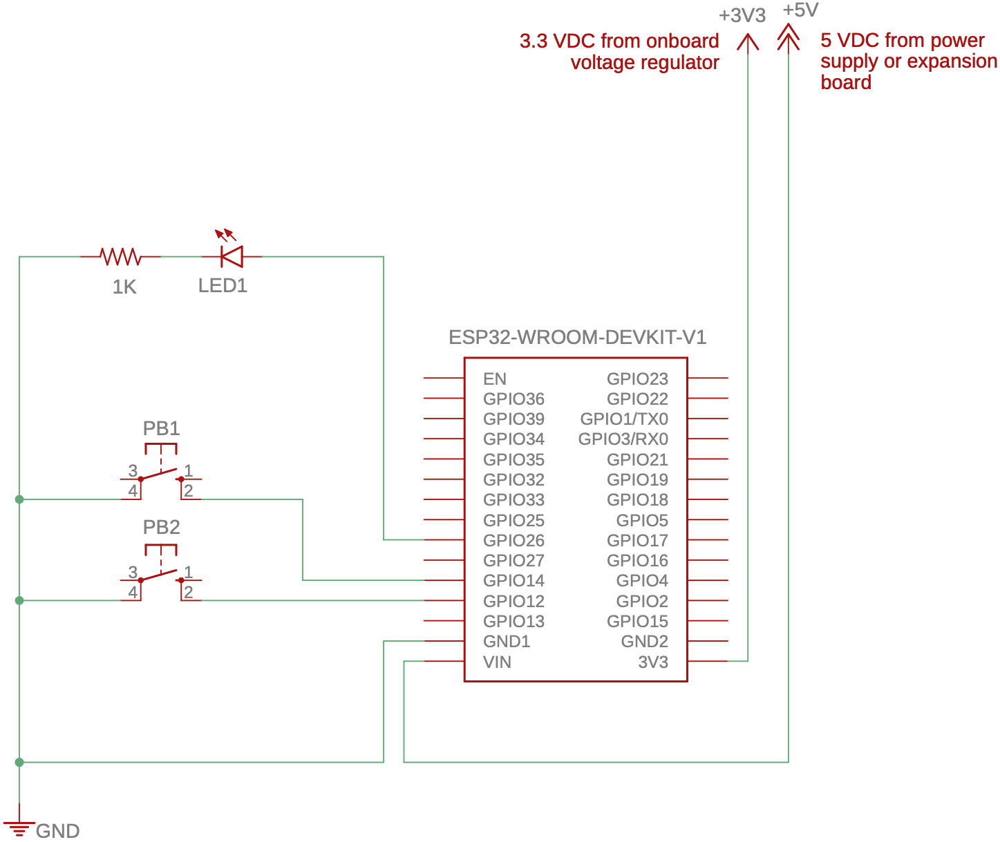

   Using a second ESP32 expansion board and a solderless breadboard, build the controller circuit shown below with an MX1508 dual DC motor driver connected to GPIO16 and GPIO17 (IN1 and IN2 for Motor 1) and GPIO18 and GPIO19 (IN3 and IN4 for Motor 2). The MX1508 should be supplied with 5 VDC. For Motor 1, connect M1 (white wire) and M2 (red wire) to the MOTOR-A pins on the MX1508. Connect C1 (green wire) to GPIO25 and C2 (yellow wire) to GPIO26. The encoder VCC (black wire) should be connected to 3.3 VDC and GND (indigo wire) to ground. Similarly for Motor 2, connect M1 and M2 to the MOTOR-B pins, C1 to GPIO32, C2 to GPIO33, VCC to 3.3 VDC and GND to ground. **Be very careful to not connect the encoder VCC to 5 VDC.** Connect an LED to GPIO27.
   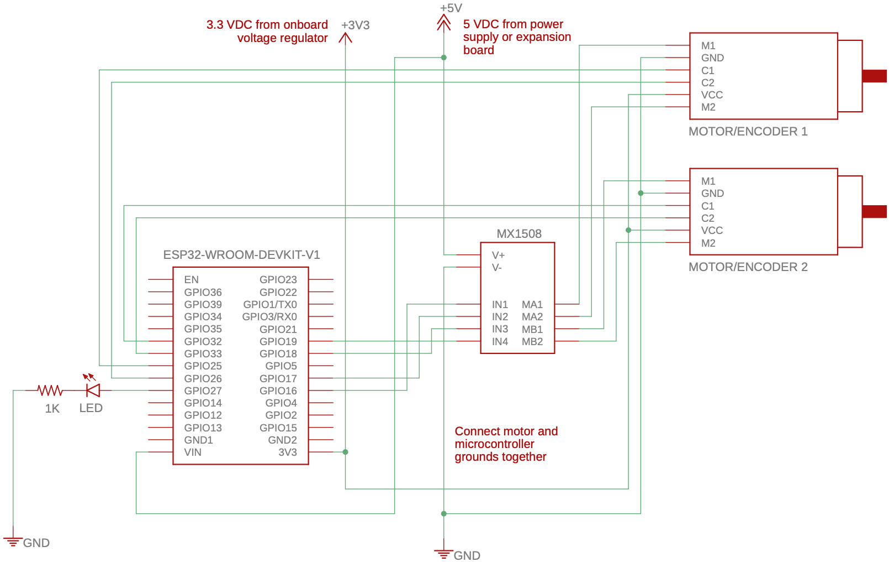

   The completed circuits should look as shown below:
   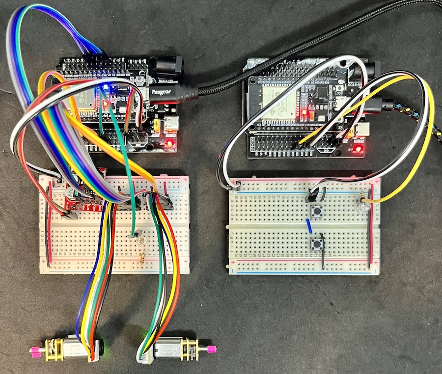

   Clone this repository and checkout the **exercise1** branch. Find the example sketch **Lab5-controller.ino**, which is located in the [Lab5-controller](Lab5-controller) folder and upload it to the controller ESP32. For the drive, find the example sketch **Lab5-drive.ino**, which is located in the [Lab5-drive](Lab5-drive) folder and upload it to the drive ESP32. Confirm that the built-in "heartbeat" LEDs connected to GPIO2 blink at an even interval. Run each program and observe the output on the Serial Monitor. The MAC address of each ESP32 will be indicated. 
   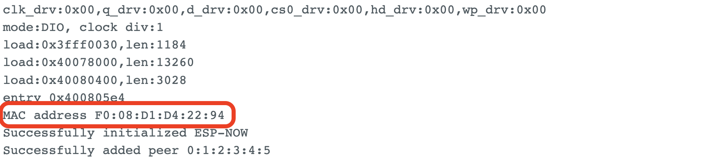
   
   Update the `receiverMacAddress` variable in the controller code with the MAC address of the drive ESP32; similarly, update the same variable in the drive code with the MAC address of the controller ESP32. Upload the revised code and confirm that the connection status LED on each board is not on.
   
   Once the ESP32s are connected to one another, the controller will continuously send direction information (`dir`) to the drive. When neither pushbutton is pressed the direction is 0, which is interpreted by the drive as stop. Pressing PB1 will update the direction to 1 (forward) and pressing PB2 will update the direction to -1 (reverse). Observe the response of the DC motors as the pushbuttons are pressed. Also confirm the "safe" behaviour of the system when power is disconnected from the controller and when power is disconnected from the drive. Show your operating system to a TA before proceeding to the next exercise.

2. Add a hand-turn potentiometer (with black knobs) connected to GPIO34 (A6) to the controller circuit, as shown in the schematic below. The drive circuit is unchanged.
   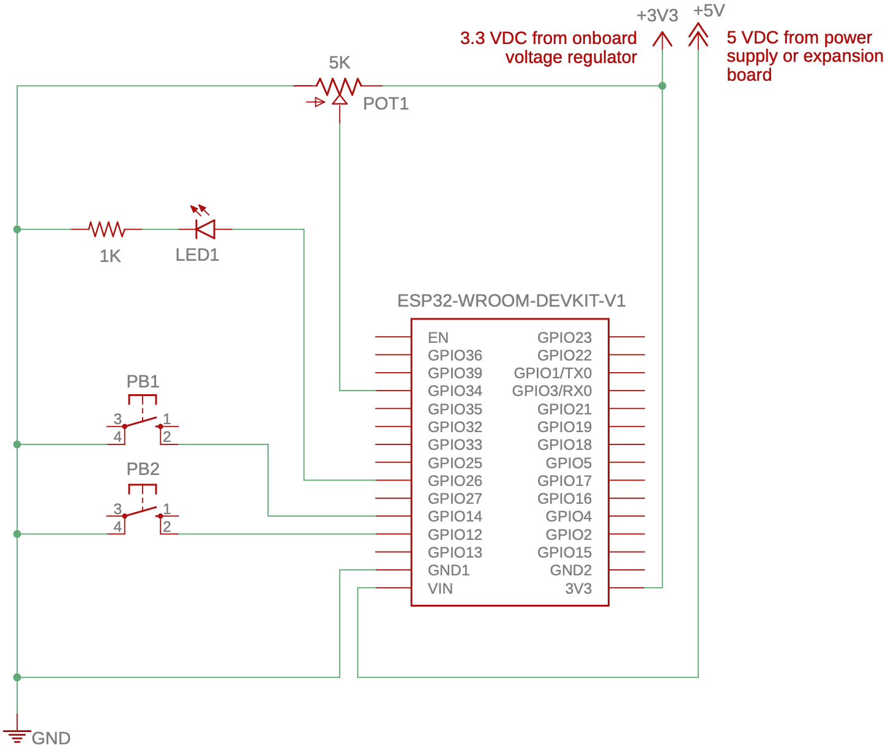
   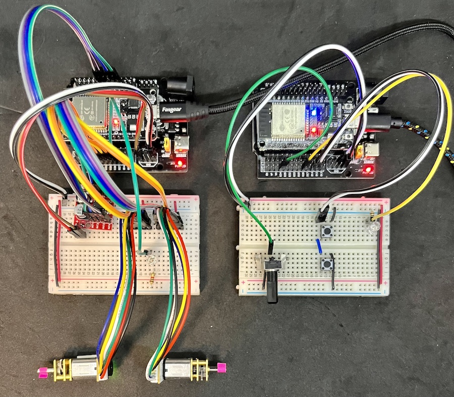
   
   Create a new branch, named **exercise2**, and switch to it. Modify the sketches from Exercise 1 so that the potentiometer controls the speed of the drive motors. This will involve adding a new member variable to the `ControlDataPacket` structure that is used by both sketches. Observe the response of the DC motors as the potentiometer is rotated and the pushbuttons are pressed. Once everything is working properly, push your repository back to GitHub. Show your operating circuit to a TA before proceeding to the next exercise.
   
3. Add two pushbuttons connected to GPIO13 and GPIO26 to the controller circuit, as shown in the schematic below. The drive circuit is again unchanged.
   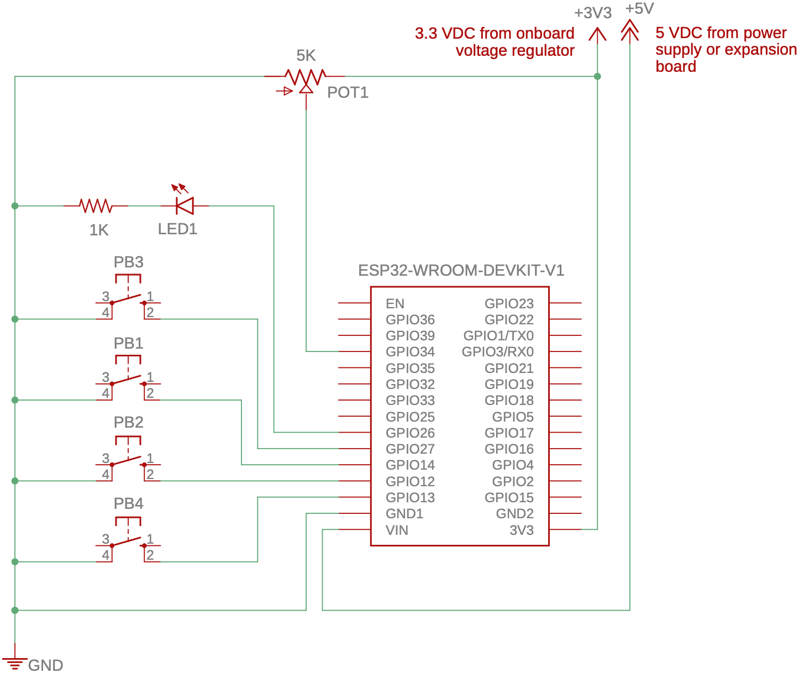
   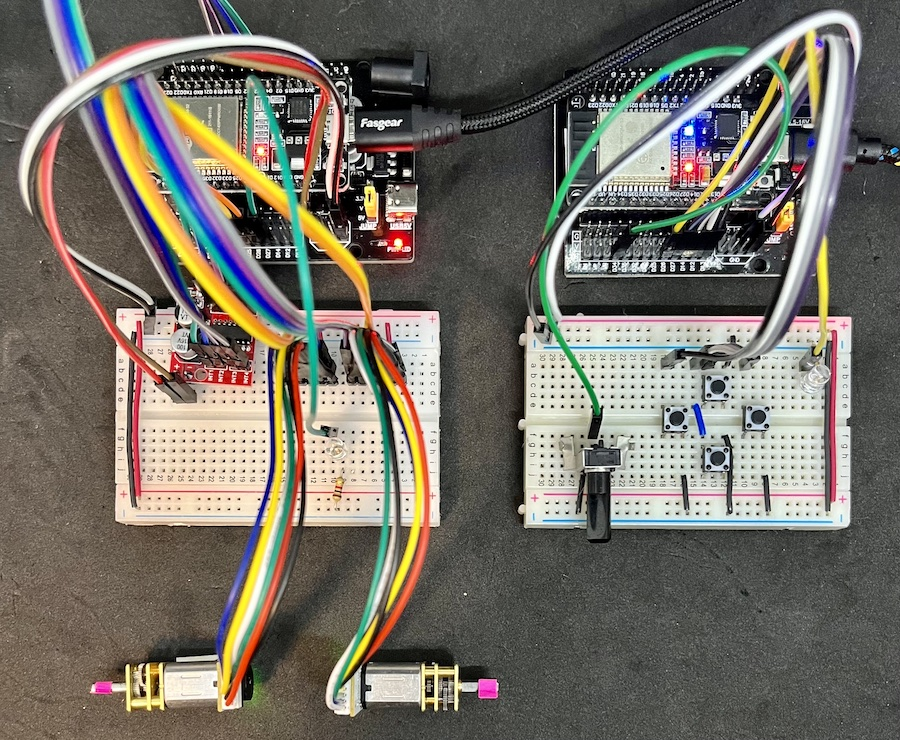
   
   Create a new branch, named **exercise3**, and switch to it. Modify the sketches from Exercise 2 so that the additional pushbuttons control left and right turning of the "robot" drive. The drive motors should only rotate when either the forward or reverse pushbuttons are pressed. The left and right pushbuttons should _modify_ the drive operation by stopping the appropriate motor to cause the "robot" to turn. Specifically, the left pushbutton should stop the left motor, resulting in the "robot" turning left; the right pushbutton should stop the right motor, resulting in the "robot" turning right. Once everything is working properly, push your repository back to GitHub. Show your operating circuit to a TA before proceeding to the next exercise.

4. Add a second LED connected to GPIO25 to the controller circuit, as shown in the schematic below.
   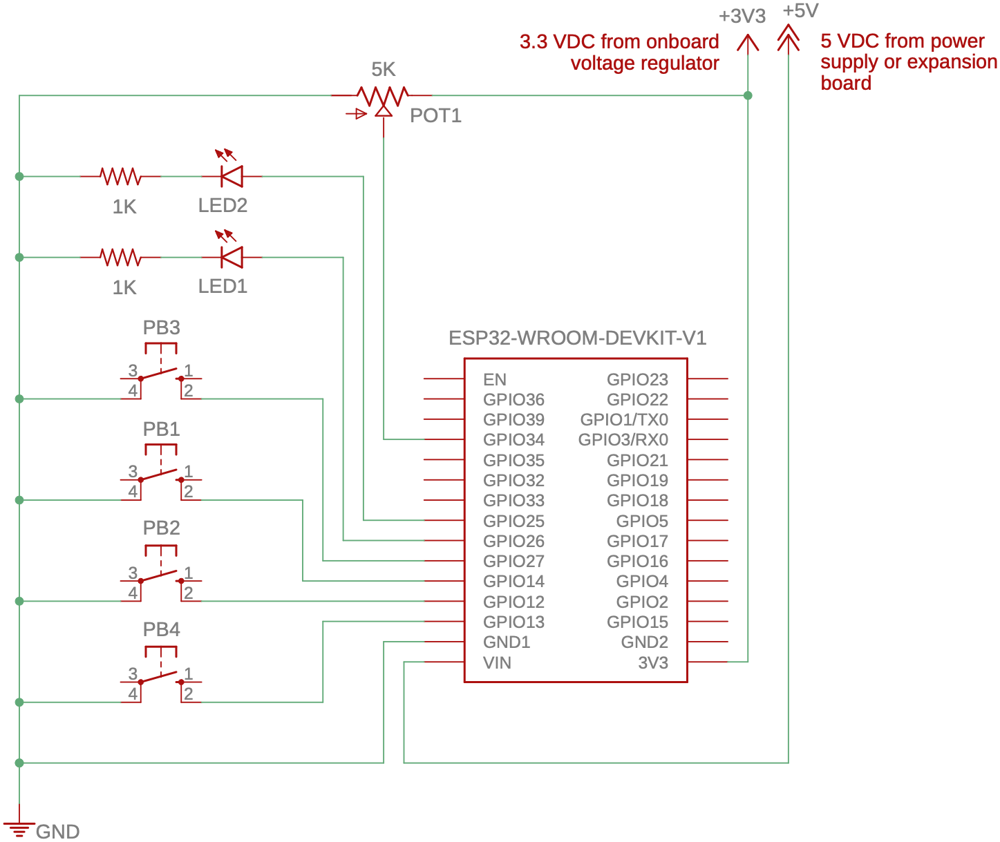

   Add a [TCS32725](https://cdn-shop.adafruit.com/datasheets/TCS34725.pdf) colour sensor to the drive circuit, as shown in the schematic below. 
   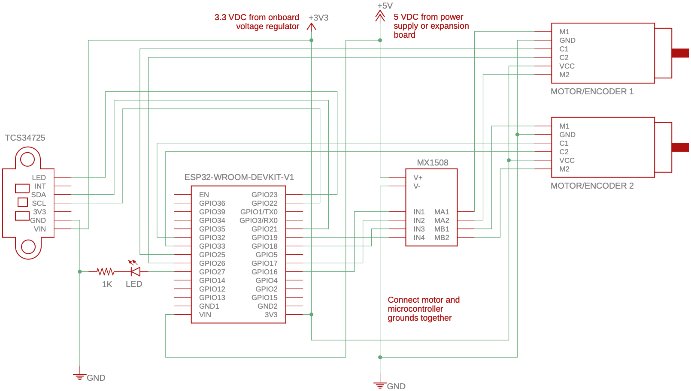
   
   The completed circuits should look as shown below:
   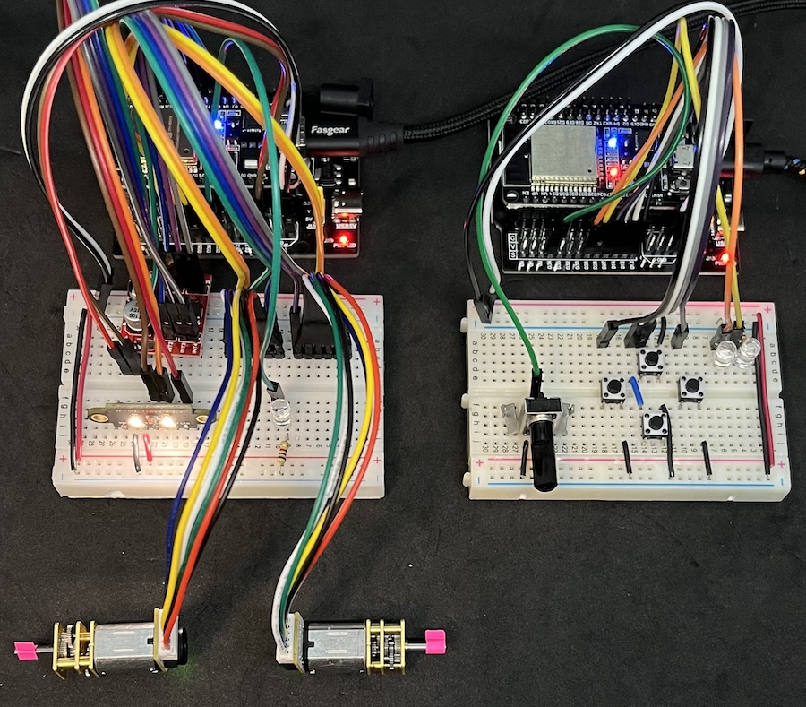
   
   To utilize the TCS34725 colour sensor, the [Adafruit TCS34725 Library](https://www.arduino.cc/reference/en/libraries/adafruit-tcs34725/) must be installed. The can be done by clicking the Library icon on the left toolbar or by selecting the **Tools→Manage Libraries**. Enter "tcs34725" in the filter textbox. Scroll to find the "**Adafruit TCS34725** by Adafruit" library. Ensure that the latest version (≥ 1.4.2) is selected and press the **INSTALL** button. You will be asked whether you also want to install the dependency **Adafruit BusIO**. Select **INSTALL ALL**. 
   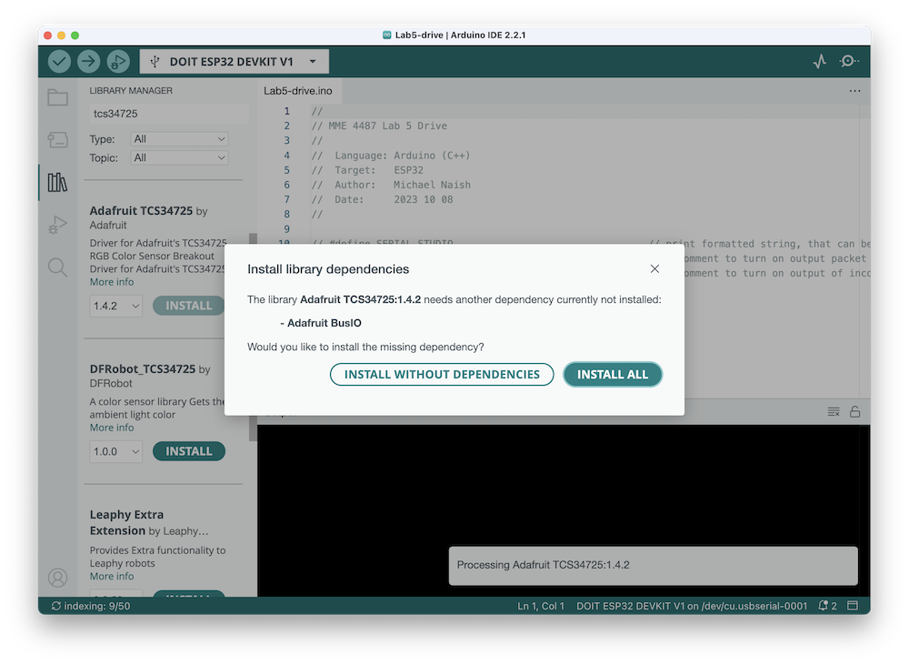

   Once the Adafruit TCS34725 library has been installed, you can upload the example sketch **Lab5-tcs34725.ino**, which can be found in the [Lab5-tcs34725](Lab5-tcs34725) folder, to the drive ESP32. Confirm that the sensor is operating properly by using the Serial Monitor to observe the RBGC values when objects of different colours are placed in close proximity to the sensor. 
   
   Create a new branch, named **exercise4**, and switch to it. Modify the sketches from Exercise 3 so that LED2 on the controller turns on when a "good" object is detected by the colour sensor. This will involve determining the RBG (and possibly C) threshold values for a coloured object of your choice. Code from the **Lab5-tcs34725.ino** sketch may be used to initialize and read values from the TCS34725. The `DriveDataPacket` should be augmented with a new member variable that is updated by the drive (according to the threshold values) and sent back to the controller. The LED should turn on when objects that meet the threshold criteria (i.e., a particular colour) are detected; otherwise, it should be off. The controller and drive operation should otherwise be the same as Exercise 3. Once everything is working properly, show your operating system to a TA. If you have not done so already, be sure to __*push your respository back to GitHub*__.  __**Failure to do so will result in a grade of 0 for the lab.**__

5. **BONUS** Implement the ability to "turn in place". This would involve turning the motors at the same speed in opposite directions. When _only_ the right pushbutton is pressed, then the right motor should spin in reverse and the left motor should spin forward; when _only_ the left pushbutton is pressed, then the left motor should spin in reverse and the right motor should spin forward. If the forward or reverse pushbuttons are pressed at the same time as the right or left pushbuttons, the drive should behave as it did in Exercise 3.

### Other Things to Explore

1. Update the drive sketch to slow, but not stop, the motors when turning.
2. Implement a way to trigger a sensor colour measurement and control the built-in LED to only turn on during measurement.
3. Use two potentiometers (or a [joystick module](https://components101.com/modules/joystick-module)) in place of the pushbuttons. One potentiometer should control forward and reverse motion, with the centre position corresponding to stop. The second potentiometer should control left and right motion, with the centre position corresponding to straight. To simplify operation, a "deadband" around the centre position should be implemented to allow a wider range of positions around the centre to stop the "robot" and specify straight (non-turning) operation. 

## Resources

* [Arduino Language Reference](https://www.arduino.cc/reference/en/)
* [DOIT ESP32 DevKit V1 Pinout and Arduino Reference](https://www.circuitstate.com/pinouts/doit-esp32-devkit-v1-wifi-development-board-pinout-diagram-and-reference)
* [Arduino-ESP32 GPIO API](https://docs.espressif.com/projects/arduino-esp32/en/latest/api/gpio.html)
* [Arduino-ESP32 ESP-NOW API](https://docs.espressif.com/projects/arduino-esp32/en/latest/api/espnow.html#resources)
* [LEDC Peripheral Reference](https://docs.espressif.com/projects/esp-idf/en/latest/esp32/api-reference/peripherals/ledc.html)
* [Resistor Colour Code Guide](https://www.digikey.ca/web%20export/mkt/general/mkt/resistor-color-chart.jpg)
* [Potentiometer Data Sheet—B (linear) taper](https://www.bourns.com/docs/Product-Datasheets/PTV09.pdf)
* [G12-N20-100 Geared Mini DC Motor](https://www.handsontec.com/dataspecs/motor_fan/GA12-N20.pdf)
* [G12-N20-100 Specifications](docs/GA12-N20_specs.png)
* [MX1508 Dual DC Motor Driver](https://components101.com/modules/mx1508-dc-motor-driver-pinout-features-datasheet)
* [TCS34725 Colour Sensor Datasheet](https://cdn-shop.adafruit.com/datasheets/TCS34725.pdf)
* [Adafruit TCS34735 Arduino Library](https://www.arduino.cc/reference/en/libraries/adafruit-tcs34725)
* [Adafruit TCS34725 GitHub](https://github.com/adafruit/Adafruit_TCS34725)
* Example videos and other links are available on [OWL](https://owl.uwo.ca/portal/site/2454dbe4-ae10-43ff-b56c-b3a2f8930865).

## Evaluation

|Task        | Maximum Marks | Demo | Code | Comments |
|:-----------|:-------------:|:----:|:----:|:--------:|
| Exercise 1 | **10**        | 10   | —    | —        |
| Exercise 2 | **20**        | 10   | 5    | 5        |
| Exercise 3 | **30**        | 10   | —    | —        |
| Exercise 4 | **40**        | 10   | 5    | 5        |
| _Bonus_    | _**10**_      | _5_  | _5_  | —        | 
